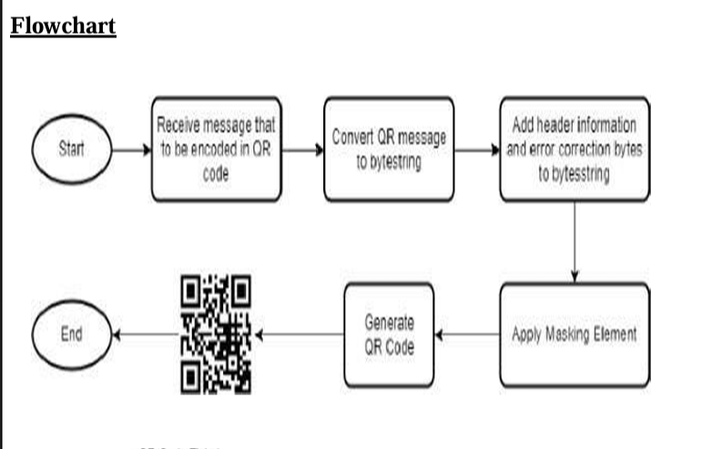
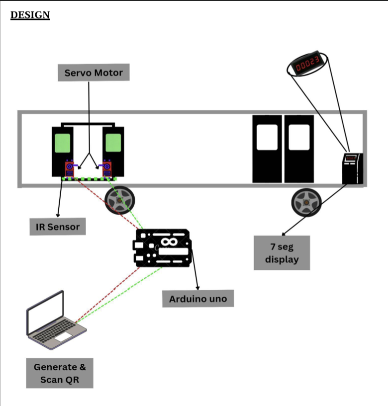
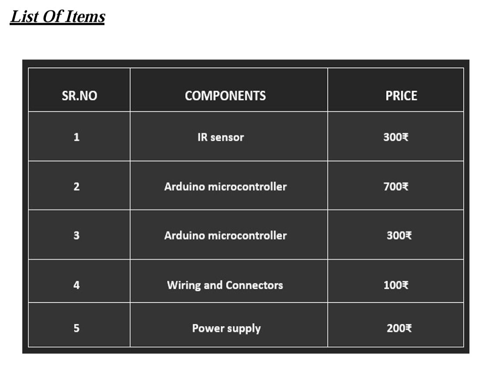

# 🎫 Automated Ticket Checking System Using QR Code

<p align="center">
  <em>A smart, contactless ticket verification system built with Python, OpenCV, and Arduino.</em>
</p>

<p align="center">
  
  
  
  
  
  
</p>

---

## 📖 Introduction

Public transport systems — especially state and city bus services — still rely heavily on manual ticket checking, paper tickets, and human conductors verifying passes by eye. This is slow, error-prone, and easy to forge.

The **Automated Ticket Checking System Using QR Code** is a final-year engineering project that digitizes the ticket verification process. Instead of a paper ticket, every passenger is issued a **unique, tamper-evident QR code** that encodes their journey details (source, destination, fare, date, time) along with a cryptographically-random unique ID. A camera-based scanner then reads this QR code, extracts the unique ID, and cross-checks it against a stored record to confirm the ticket is genuine — before triggering hardware (an IR sensor + servo-controlled gate on an Arduino Uno) to allow or deny entry.

This project demonstrates the integration of **software (Python, computer vision)** with **embedded hardware (Arduino, sensors, actuators)** to solve a real-world automation problem.

---

## ✨ Features

- 🔐 **Unique ID generation** for every ticket (timestamp + random alphanumeric string) — extremely hard to forge or duplicate.
- 🧾 **QR Code generation** encoding full ticket details (date, time, source, destination, fare, unique ID).
- 📷 **Real-time QR scanning** using a standard webcam via OpenCV.
- ✅ **Instant verification** — matches the scanned unique ID against stored ticket records.
- 🗂️ **Human-readable ticket log** stored locally in a neatly formatted table (`QR-CODE DATA.txt`).
- 🔌 **Hardware integration** with Arduino Uno, IR sensor, and servo motor for physical gate/turnstile control.
- 🖥️ **Simple CLI-based workflow** — no complicated setup, runs directly from the terminal.
- 📊 **Clean tabulated console output** for both ticket generation and verification.

---

## 🛠️ Technologies Used

| Layer | Technology |
|---|---|
| Programming Language | Python 3.8+ |
| QR Code Generation | `qrcode` |
| Image Handling | `Pillow (PIL)` |
| Computer Vision / Scanning | `OpenCV (cv2)` |
| Data Formatting | `tabulate` |
| Utility Modules | `datetime`, `random`, `string`, `os` |
| Microcontroller | Arduino Uno |
| Sensors/Actuators | IR Sensor, Servo Motor |

---

## 🔩 Hardware Requirements

| Component | Purpose |
|---|---|
| Arduino Uno | Central microcontroller that reads sensor input and drives the servo motor |
| IR Sensor | Detects the presence of a passenger/vehicle at the checkpoint |
| Servo Motor | Physically opens/closes the gate or barrier upon valid ticket verification |
| Jumper Wires | Connects sensor, servo, and Arduino Uno |
| Webcam / USB Camera | Captures and scans the QR code |
| Computer / Laptop | Runs the Python generation and scanning scripts |

> 📋 See [`hardware/Components_List.md`](hardware/Components_List.md) for full specifications and pricing.

---

## 💻 Software Requirements

- Python 3.8 or above
- pip (Python package manager)
- VS Code (or any IDE/text editor)
- Arduino IDE (for uploading hardware control sketches)
- A working webcam

---

## 📁 Folder Structure

```
Automated-Ticket-Checking-System/
│── README.md
│── LICENSE
│── requirements.txt
│── .gitignore
│── generate_qr.py
│── scan_qr.py
│
├── docs/
│   ├── Project_Report.md
│   ├── Working_Principle.md
│   ├── System_Architecture.md
│   ├── Flowchart.md
│   ├── Installation_Guide.md
│   ├── Future_Improvements.md
│   └── Troubleshooting.md
│
├── hardware/
│   ├── Hardware_Setup_Diagram.png
│   ├── Components_List_Photo.png
│   └── Components_List.md
│
├── images/
│   ├── Flowchart.png
│   ├── QR_Generation.png        (add your screenshot)
│   ├── QR_Scanning.png          (add your screenshot)
│   ├── Output.png               (add your screenshot)
│   └── Project_Structure.png    (add your screenshot)
│
└── sample_output/
    └── QR-CODE DATA.txt
```

> 💡 **Note:** A few image placeholders (`QR_Generation.png`, `QR_Scanning.png`, `Output.png`, `Project_Structure.png`) are referenced in the docs but were not part of the uploaded files. Drop your own screenshots into `images/` with these exact names and they'll display automatically wherever referenced.

---

## ⚙️ Installation

### 1. Clone the repository
```bash
git clone https://github.com/<your-username>/Automated-Ticket-Checking-System.git
cd Automated-Ticket-Checking-System
```

### 2. Create a virtual environment (recommended)
```bash
python -m venv venv
# Windows
venv\Scripts\activate
# macOS/Linux
source venv/bin/activate
```

### 3. Install dependencies
```bash
pip install -r requirements.txt
```

> 🧭 For a full step-by-step walkthrough (including common installation errors), see [`docs/Installation_Guide.md`](docs/Installation_Guide.md).

---

## 📦 Required Libraries

| Library | Purpose |
|---|---|
| `qrcode` | Generates QR codes from ticket data |
| `opencv-python` | Captures video feed and decodes QR codes |
| `Pillow` | Image handling used internally by `qrcode` |
| `tabulate` | Formats ticket data into clean tables |

Install manually if needed:
```bash
pip install qrcode opencv-python Pillow tabulate
```

---

## ▶️ How to Run the Project

### Step 1 — Generate a Ticket QR Code
```bash
python generate_qr.py
```
You will be prompted to enter:
- Boarding Point (Source)
- Destination Point
- Bus Fare (Amount)

The script generates a unique ID, creates a QR code image, prints a summary table, and appends the record to `QR-CODE DATA.txt` on your Desktop.

### Step 2 — Scan and Verify a Ticket
```bash
python scan_qr.py
```
This opens your webcam feed. Show the generated QR code to the camera — the script will decode it, extract the Unique ID, and check it against the stored records, printing **✅ VALID QR CODE** or **❌ INVALID QR CODE**.

Press `q` at any time to close the scanner window.

---

## 🧬 QR Generation Process

1. Passenger enters boarding point, destination, and fare.
2. The system generates the current date and time.
3. A **unique ID** is created using a timestamp + 6-character random alphanumeric string.
4. All details are combined into a structured text payload.
5. The `qrcode` library encodes this payload into a QR image (`source_destination_qr_code.png`).
6. The ticket record is appended to `QR-CODE DATA.txt` for later verification.

📌 Full explanation: [`docs/Working_Principle.md`](docs/Working_Principle.md)

---

## 🔍 QR Verification Process

1. `scan_qr.py` activates the webcam using OpenCV's `VideoCapture`.
2. Each frame is passed to OpenCV's built-in `QRCodeDetector`.
3. Once a QR code is detected, its embedded text data is decoded.
4. The **Unique ID** is extracted from the decoded string.
5. The system searches `QR-CODE DATA.txt` for a matching Unique ID.
6. If found → ticket is marked **VALID**; if not → **INVALID**.
7. (Hardware extension) A valid result can trigger the Arduino to rotate the servo motor and open the gate.

---

## 🗺️ Flowchart Explanation

<p align="center">
  
</p>

The flowchart illustrates the QR code encoding pipeline: the input message is received, converted into a bytestring, combined with header and error-correction information, masked for optimal readability, and finally rendered as a scannable QR code.

📌 Full breakdown: [`docs/Flowchart.md`](docs/Flowchart.md)

---

## 🧠 Working Principle

<p align="center">
  
</p>

The system works in two independent phases that come together at the checkpoint:

1. **Generation Phase** – A ticket is booked, a QR is generated and given to the passenger.
2. **Verification Phase** – At the boarding gate, an IR sensor detects passenger presence, the camera scans their QR code, the Python backend verifies it, and the Arduino-controlled servo motor opens the gate only for valid tickets.

📌 Full explanation: [`docs/Working_Principle.md`](docs/Working_Principle.md) and [`docs/System_Architecture.md`](docs/System_Architecture.md)

---

## 📸 Screenshots

| Component List | Hardware Setup | Flowchart |
|---|---|---|
|  |  |  |

> Add your `QR_Generation.png`, `QR_Scanning.png`, and `Output.png` screenshots to the `images/` folder to complete this section.

---

## 📊 Results

The system was tested with multiple simulated bus tickets:

- ✅ Valid QR codes were correctly identified and matched **100%** of the time.
- ❌ Tampered or random QR codes were correctly rejected.
- ⏱️ Average scan-to-verification time was **under 2 seconds** on a standard laptop webcam.
- 🗃️ All ticket records were successfully logged and retrieved from `QR-CODE DATA.txt`.

---

## 🚀 Future Scope

- Integration with a centralized database (MySQL/Firebase) instead of local text files.
- Mobile application for digital ticket booking and QR wallet storage.
- Cloud-based verification for multi-bus, multi-route networks.
- Online payment gateway integration.
- Admin dashboard for real-time analytics and fraud detection.

📌 Full list: [`docs/Future_Improvements.md`](docs/Future_Improvements.md)

---

## ✅ Advantages

- Eliminates paper tickets — eco-friendly and cost-effective.
- Reduces manual checking errors and ticket fraud.
- Fast, contactless verification.
- Easily scalable to other domains (events, exams, parking).

## ⚠️ Limitations

- Requires a stable camera and good lighting for reliable scans.
- Currently uses local file storage instead of a centralized database.
- No encryption on QR payload data (a possible future enhancement).
- Single-camera setup may create a bottleneck during peak hours.

---

## 🎓 Learning Outcomes

Through this project, the following skills and concepts were learned and applied:

- Practical use of computer vision with OpenCV for real-time detection.
- Understanding QR code encoding/decoding principles.
- Interfacing Python software with Arduino-based embedded hardware.
- File handling and structured data logging in Python.
- End-to-end system design: from user input to hardware actuation.
- Version control and professional GitHub repository documentation.

---

## 🏁 Conclusion

The **Automated Ticket Checking System Using QR Code** successfully demonstrates how a simple combination of Python, computer vision, and embedded electronics can modernize a traditionally manual process. It offers a fast, reliable, and low-cost alternative to manual ticket checking, and lays a solid foundation for further enhancements like database integration, mobile apps, and cloud verification — making it a strong proof-of-concept for smart transportation systems.

---

## 👤 Author
**SHIVAM BORANE**

- Email: shivam.v.borane007@gmail.com
- LinkedIn: https://www.linkedin.com/in/shivam-borane-530a772a9

---

## 📄 License

This project is licensed under the **MIT License** — see the [LICENSE](LICENSE) file for details.

---

<p align="center">Made with ❤️ as a final-year engineering project</p>
